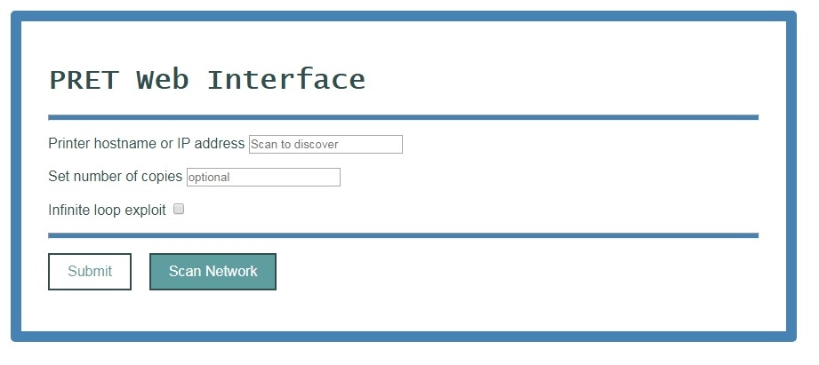

# WebPRET

This is web based interface for PRET (PRinter Exploitation Toolkit), more information on PRET can be found at https://github.com/RUB-NDS/PRET 

## Background:

WebPRET runs a cherrypy webserver on a host machine which allows any device capable of accessing the cherrypy website to perform some PRET exploits on printers connected to the host machine's network. The current functions use the PostScript protocol and are able to set the number of copies through the config command and crash the printer using an infinite loop written in PostScript. The interface is also able to perform a network scan for hosts with port 9000 open and dynamically render a table with hostnames and shortcuts to exploits. In the future I would like to have the built in IP scanner be able to automatically detect the host machine's subnet as well as add more PRET functionality.

## Getting it to work:

Use the link above to download PRET and install dependencies. Test and make sure PRET is working before continuing.

WebPRET requires Python 2 and the cherrypy library, install or create a virtual environment of Python 2 and pip install cherrypy. Place the contents of this repo ('webpret.py' file and 'static' folder) into the PRET folder. Run webpret.py to start the server. _Read through the webpret.py code and make appropriate changes for your network environment._

## Using WebPret:

The interface is designed to be self explanatory. Remotely stopping the server is possible and can be acheived by manually navigating to the /kill url of your server.

## Interface Examples

### Landing Page

### Network Scan

### Console Output

